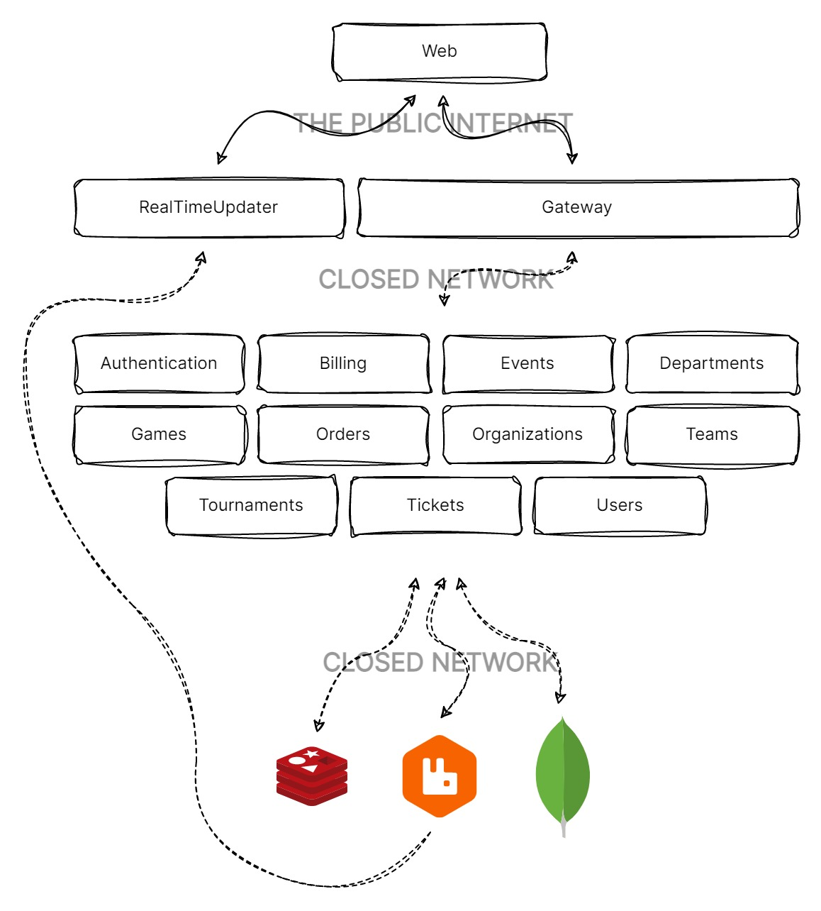

# Svendeprøve

This is the final project of [Sofus Skovgaard](https://github.com/sofusskovgaard), [Joachim Tøfting](https://github.com/JoachimToefting) and [Allan Holm Iversen](https://github.com/hund555).

## Introduction

EUC Syd has contacted us to provide a proof-of-concept for their eSport association system.

We have been tasked with delivering a requirement specification for a comprehensive system that allows for live streaming, administrative tasks, and presents a public user interface.

### Purpose

EUC Syd would want a system to operate a national eSport federation.

The purpose is to make it easier to bring together smaller eSport associations/clubs to organize tournaments and bring people together. There will be several smaller systems that will communicate with each other, and there will be some cloud solutions to make it more environmentally friendly.

## Getting started

### Prerequisites

Make sure you have installed all of the following on your development machine.

- .NET 7 - [Download and install](https://dotnet.microsoft.com/en-us/download/dotnet/7.0) the latest version of the .NET 7 SDK.
- Docker Desktop - [Download and install](https://www.docker.com/products/docker-desktop) the latest version of Docker Desktop.

If you want to be able to debug in the MongoDB and Redis databases, make sure to install the following as well.

- MongoDB Compass - [Download and install](https://www.mongodb.com/products/compass) the latest version of MongoDB Compass.
- RedisInsight - [Download and install](https://github.com/RedisInsight/RedisInsight/releases) the latest version of RedisInsight.

### Quick start

Run this in the application folder from the command-line:

```
$ docker compose up -d
```

This will build the API-Gateway and all the underlying services as individual docker images and start them up in a semi closed docker network.

- Find the API-Gateway at [https://localhost:3000/swagger](https://localhost:3000/swagger)
- Find the SignalR service at [https://localhost:3001](https://localhost:3001)

The network will also contain a MongoDB, RabbitMQ and Redis container. All of which have forwarded ports.

- MongoDB has the main port 27017 opened.
- RabbitMQ has the management port 15672 opened.
- Redis has the main port 6379 opened.

## Overview


> This is sketch of what the application architecture roughly looks like.

- The *Web* application is a [Blazor Webassembly](https://dotnet.microsoft.com/en-us/apps/aspnet/web-apps/blazor) application. This application runs in the browser of the clients and interfaces with the RealTimeUpdater and Gateway services.
- We like to call the *RealTimeUpdater* service the [SignalR](https://dotnet.microsoft.com/en-us/apps/aspnet/signalr) broker. It listens to events from RabbitMQ and will distribute relevant events to the correct parties via a [SignalR](https://dotnet.microsoft.com/en-us/apps/aspnet/signalr) Hub.
- The *Gateway* service is an API which acts as a Gateway to all the underlying services. It exclusively communicates with all services via gRPC.
- All the other internal services exclusively communicate via AMQP messages.